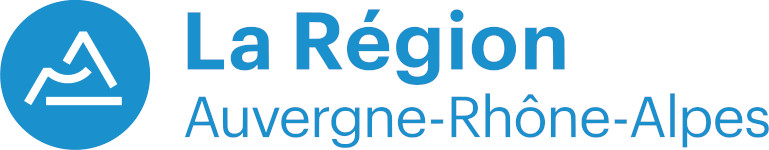
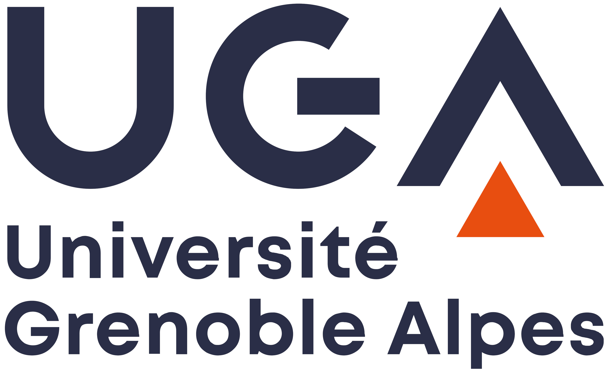
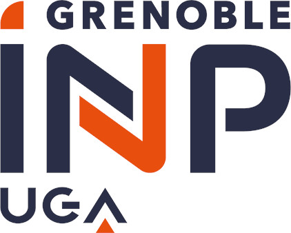
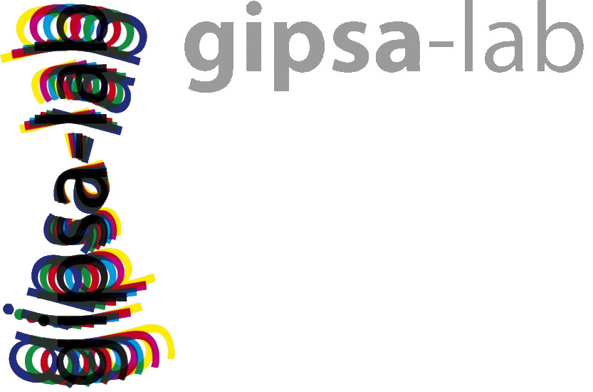

# Introduction

This repository provides a **PyQt5-based graphical interface** for 
visualizing and controlling **industrial cameras** through a device-independent 
API. It is designed to be **user-friendly, minimal, flexible**, and adaptable 
to a range of camera models and acquisition scenarios.

## Key Features
- Live **data stream visualization**
- **Pause/resume** image acquisition
- Switch between **mosaiced and demosaiced** image views
- Support for **bit-depth switching**
- **Frame sequence recording** in ENVI and NumPy formats
- Adjustment of **frames per second (FPS)**
- **Exposure time control** with live feedback

## Supported Cameras
This interface was originally developed to work with the following models:
- **XIMEA MQ02HG-IM-SM4x4-REDNIR**  
  A hyperspectral camera using a 4×4 color filter array in the RED/NIR range.
- **The Imaging Source DFK 23UX236**  
  A compact RGB camera featuring a Bayer color filter array.

## Deployment Context
During an acquisition campaign in Japan (July–August 2025), these cameras were 
mounted on a **JetArm Track T1** robotic system using a tripod affixed to the 
mechanical arm.
Custom 3D-printed plate designs used for mounting are available in the 
`data/plate_design` directory.


# Installation instruction

## GUI

### Prerequisites

The script was tested on a Linux machine running Ubuntu 22.04.5 LTS using 
Wayland as windowing system.

You can install the provided package as a library by going to the root folder
of the cloned repository and typing:
```bash
pip install pip --upgrade
pip install .
```

For visualization, you may also need to install this library:
```bash
sudo apt install libxcb-xinerama0
```

### Testing the GUI

From this moment on you should be able to connect the camera through USB to
your machine and type:
```bash
python camera_visualizer/gui.py
```

You can also run two camera feeds at the same time by running:
```bash
python camera_visualizer/gui_double.py
```

If the dependencies are resolved internally, you can run the script directly without
installing the library by typing:
```bash
python -m camera_visualizer.gui
```

### GUI instructions

To start a camera acquisition:

- Select the proper FPS (Note: the camera may change the value internally).
- Select the camera model:
  - `mock`: fake camera to test the graphic interface;
  - `ximea`: the XIMEA camera model MQ02HG-IM-SM4x4-REDNIR;
  - `tis`: the Imaging Source camera model DFK 23UX236.
  Note: Even if no camera API is installed, the `mock` camera will showcase
  the functionalities of the GUI.
- Press the `Start` button.


For setting the exposure time, either:
- Click the button `Estimate exposure time`
- Change the exposure time in the box `Exposure time (us)` or with the slider

For saving video frames:
- Type the save format;
- Type the filename;
- Press the `Record` button;
- Press the `Stop recording` button to stop the recording. 
Files will be saved in `data/[camera_name]/[filename]_[timestamp]` and with a 
sequential index.
- In case you want to save to a custom data folder, either:
  - Type `export DATA_PATH=/your/path/to/data` in terminal before running the
    GUI
  - Create a `.env` file and put it in the same folder as this `README.md` 
    file with the only line:
    ```bash
    DATA_PATH=/your/path/to/data
    ```

To exit, just close the visualization applet.

## Camera API

For detailed instructions to install the API/SDK of the supported cameras, 
please consult our internal guides:

- [XIMEA MQ02HG-IM-SM4x4-REDNIR](./data/docs/ximea.md)
- [The Imaging Source DFK 23UX236](./data/docs/tis.md)

### Programming a new camera

To interface a new camera to the GUI:
- Define a class that follows the signature defined by the `Camera` 
  abstract class.
- Add a new enum to `CameraEnum`
- Instantiate the newly defined camera class through the `camera` function.


## Plate designs

The 3d plate  designs are intended to simultaneously mount two cameras (MQ02HG-IM-SM4x4 and TIS DFK 23UK236) over a standard tripod.

The designs, collected in the folder `data\plate_designs`, include:
- The original measurement design: `cameras_94mm_v2.pdf`
- A 2d draft for lasercuts: `plate_design.pdf`
- Blender 3d renders for the machine: `scaled_holed_plate.blend`
- An STL conversion for 3d printing: `scaled_holed_plate.stl`
- The sliced version for the Flashforge 3d printer: `scaled_holed_plate.gx`

The draft `cameras_94mm_v2.pdf` was prepared by:
- Kuniaki Uto [uto@wise-sss.titech.ac.jp](mailto:uto@wise-sss.titech.ac.jp)


## Developers

Daniele Picone  
Univ. Grenoble Alpes, CNRS, Grenoble INP, GIPSA-lab, 38000 Grenoble, France  
Work mail: [daniele.picone@grenoble-inp.fr](mailto:daniele.picone@grenoble-inp.fr)  
Personal mail: [danaroth83@gmail.com](mailto:danaroth83@gmail.com)  

Mohamad Jouni  
Floralis - Filiale UGA, Univ. Grenoble Alpes, CNRS, Grenoble INP, GIPSA-lab, 38000 Grenoble, France  
Work mail: [mohamad.jouni@grenoble-inp.fr](mailto:mohamad.jouni@grenoble-inp.fr)  
Personal mail: [mhmd.jouni@outlook.fr](mailto:mhmd.jouni@outlook.fr)  


## Acknowledgements

This work was supported by the **Auvergne-Rhône-Alpes (AuRA) region** under project **"Pack Ambition International 2021"** by **Grant 21-007356-01FONC** and **Grant 21-007356-02INV**.
It is part of a scientific collaboration between Grenoble INP - UGA (France) and Institute of Science Tokyo (Japan).
It was carried out at Hatanaka Lab, Department of Systems and Control Engineering, School of Engineering, Institute of Science Tokyo.

<div align="center">
  
  <br><br>
  <div>
    
    &nbsp;&nbsp;&nbsp;&nbsp;&nbsp;
    
    &nbsp;&nbsp;&nbsp;&nbsp;&nbsp;
    
  </div>
  <br>
  
</div>
